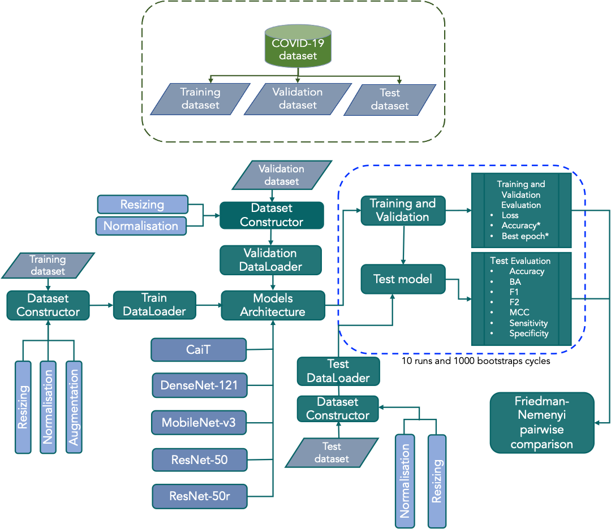
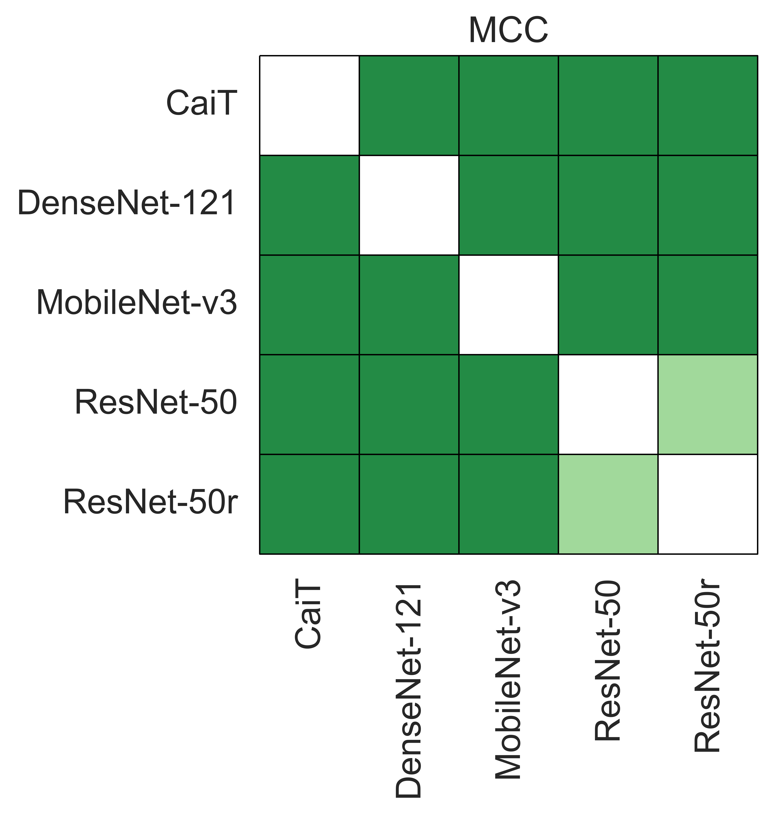
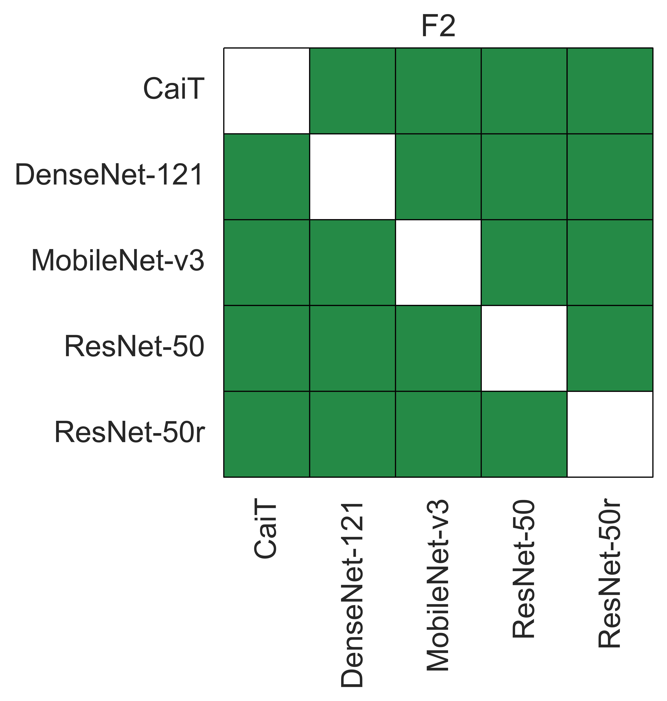
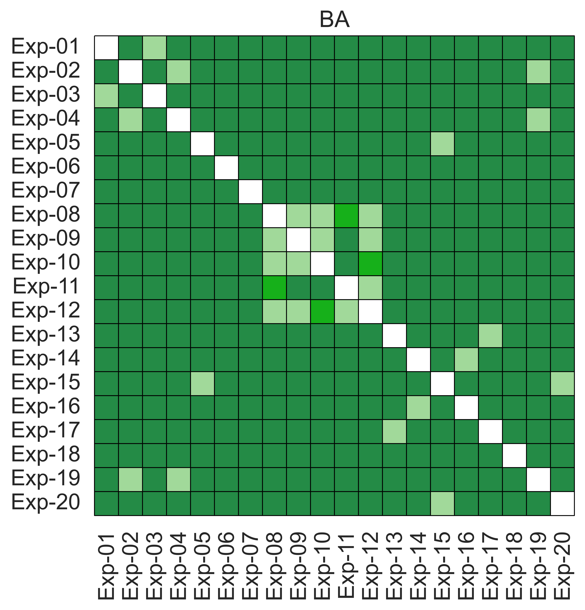
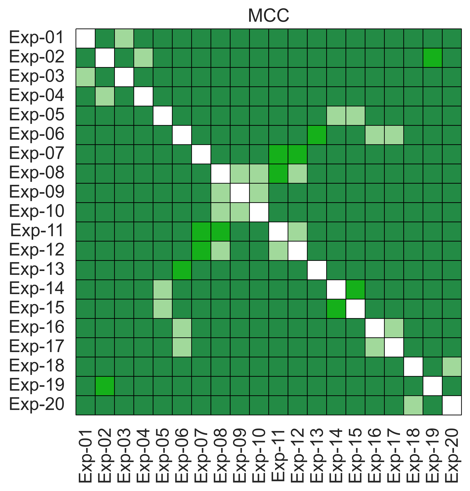
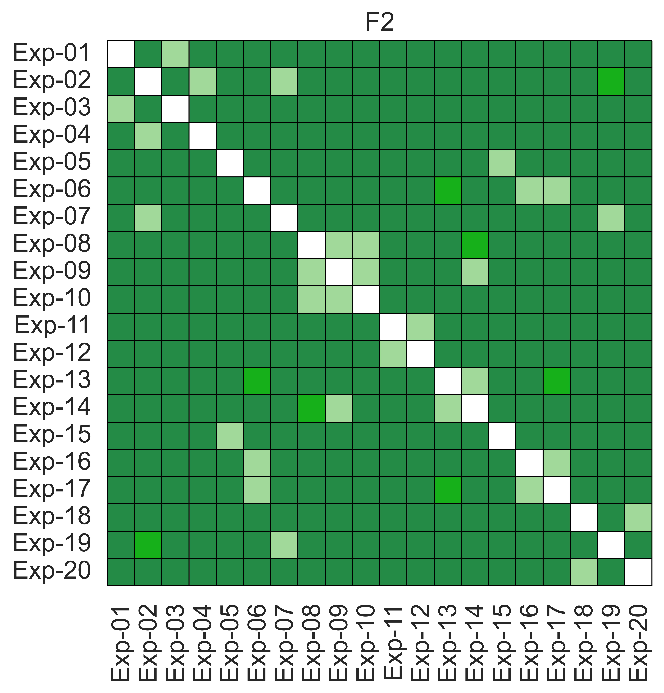
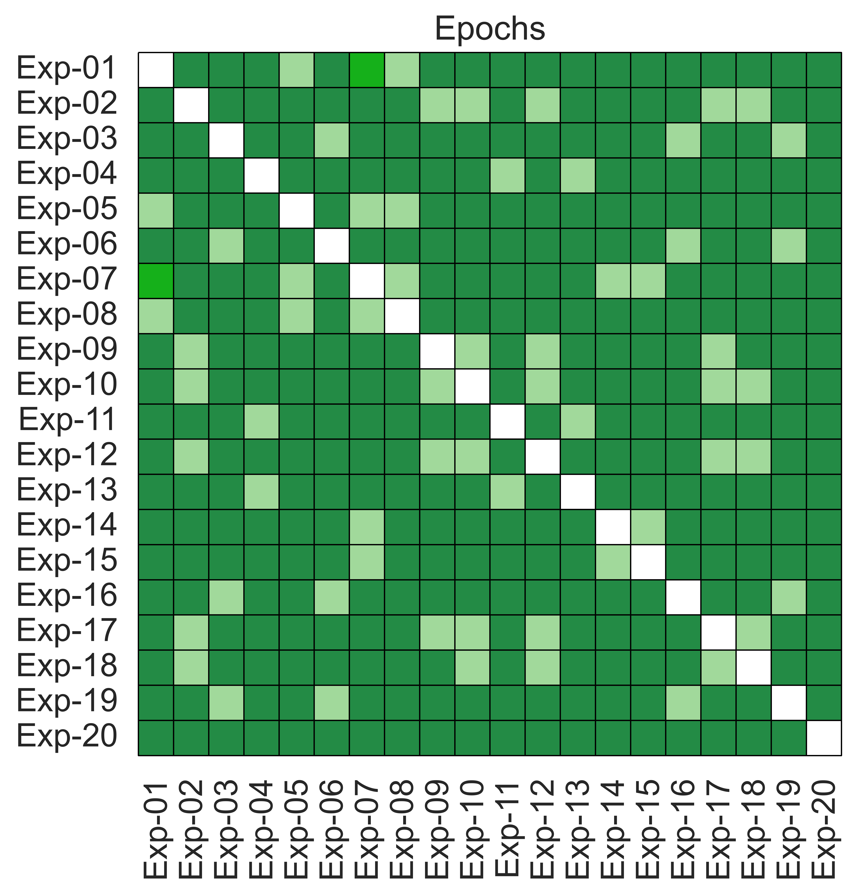

# Comparison of convolutional neural networks and transformers for the classification of images of COVID-19, Pneumonia and Healthy individuals as observed with Computed Tomography

This work has been published on the [Journal of Imaging](https://www.mdpi.com/2313-433X/8/9/237#cite). If you use our code and/or our manuscript please cite us as: 

Ascencio-Cabral, A.; Reyes-Aldasoro, C.C. Comparison of Convolutional Neural Networks and Transformers for the Classification of Images of COVID-19, Pneumonia and Healthy Individuals as Observed with Computed Tomography. J. Imaging 2022, 8, 237. https://doi.org/10.3390/jimaging8090237


## Introduction
Medical classification has been  widely benefited with recent developments in computer vision,
especially the use of deep artificial neural networks. In this work we evaluated the performance of
five deep learning architectures to classify COVID-19 in a multi-class setup.

We built an experimental setup with the following deep neural network architectures:

* CaiT-24-XXS-224 (Class Attention in image Transformers)
* DenseNet-121
* MobileNet-v3-large
* ResNet-50
* ResNet-50r (ResNet-50 with resized kernel in the first convolution layer Conv1 from  7 X 7 to 5 x 5)


## Experimental setup

Our experimental setup consisted of the combination of the five architectures, two loss functions and two optimizers.
We minimize the Cross entropy (CE) and weighted Cross Entropy (wCE) loss functions with Adam and AdamW optimizers.

Exp	 |Architecture  | Loss	 | Optimzer
-----|--------------|--------|--------
1	 |CaiT          |   CE   | Adam
2	 |CaiT          |	CE	 | AdamW
3	 |CaiT          |   wCE	 | Adam
4	 |CaiT          |   wCE	 | AdamW
5	 |DenseNet-121  |	CE	 | Adam
6	 |DenseNet-121  |   CE	 | AdamW
7	 |DenseNet-121  |   wCE	 | Adam
8	 |DenseNet-121	|   wCE	 | AdamW
9	 |MobileNet-v3-l|	CE	 | Adam
10	 |MobileNet-v3-l|   CE	 | AdamW
11	 |MobileNet-v3-l|   wCE	 | Adam
12	 |MobileNet-v3-l|   wCE	 | AdamW
13	 |ResNet-50	    |   CE	 | Adam
14	 |ResNet-50	    |   CE	 | AdamW
15	 |ResNet-50	    |   wCE	 | Adam
16	 |ResNet-50	    |   wCE	 | AdamW
17	 |ResNet-50r	|   CE	 | Adam
18	 |ResNet-50r	|   CE	 | AdamW
19	 |ResNet-50r	|   wCE	 | Adam
20	 |ResNet-50r	|   wCE	 | AdamW

## Datasets
We sourced our CT images from two public sources:
* https://www.kaggle.com/maedemaftouni/large-covid19-ct-slice-dataset
* https://data.mendeley.com/datasets/3y55vgckg6/2

## Methods

We trained and validated the models for 8 epochs and recorded their accuracy and loss during all
process. 

  


## Evaluation
We evaluated the performance of each of the experiments by using Accuracy, Balanced Accuracy (BA),
F1, F2, Mathew's correlation coefficient (MCC), Sensitivity and Specificity metrics on
the test dataset.


## Non parametric comparison
We bootstrapped the results, compute the confidence intervals, ranked the bootstrapped results and compared the performance of the models with the
Friedman-Nemenyi test.


Architecture  | Accuracy | BA    |  F1   |  F2   |  MCC |   Sen  | Spec
--------------|----------|-------|-------|------ |------|--------|--------
Cait          |   5.00   | 5.00  | 5.00  | 5.00  | 5.00 | 5.00   | 5.00
DenseNet-121  |	  3.20   | 2.98  | 2.82  | 3.18  | 3.05 | 2.92   | 3.30
MobileNet-v3-l|	  3.63   | 3.62  | 3.58  | 3.50  | 3.72 | 3.54   | 3.56
ResNet-50	  |  __1.40__   | __1.38__ | 1.92  | 1.84  | __1.53__| __1.75__  | __1.51__
ResNet-50r	  |   1.77   | 2.02  | __1.68__ | __1.47__ | 1.71 | 1.80   | 1.63


## Results

Our results showed that models based ResNet-50 are not only more accurate but learn faster than the
other networks. Our best models Exp-18 and Exp-20 achieved a MCC of 98.66\% and specificity of 99.53\% and 99.50\% respectively.


* _By network_


     
      


* _By experiment_


       
       

<p 'align='center'>

  
  
</p>


## Installation
* Setup a  Python 3.8 environment or higher
* Install Pytorch and Torchvision
* Install torchmetrics
* Install timm

### __Note:__
* When running the files replace the paths/directories with your paths to files
* The csv file contains results for the comparison
* The classification of COVID-19 can be run directly from the jupyter notebook  ```main_class.ipynb``` or on the terminal by
using the command line ``` python3 /your/path/to/main_class.py ```
* The comparison of the models performance can be run on the jupyter notebook ```main_stats.ipynb``` or on the terminal by using the command
line ``` python3 /your/path/to/main_stats.py ```
